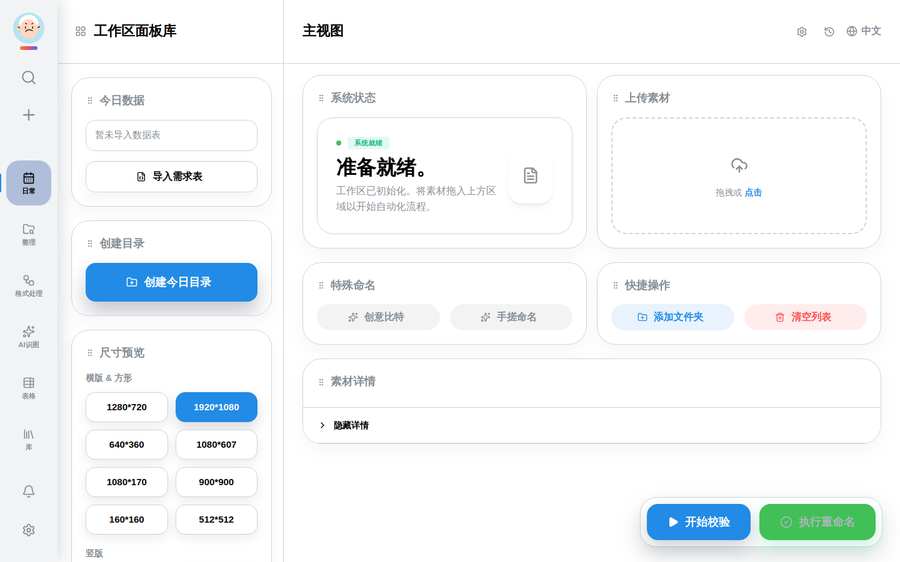
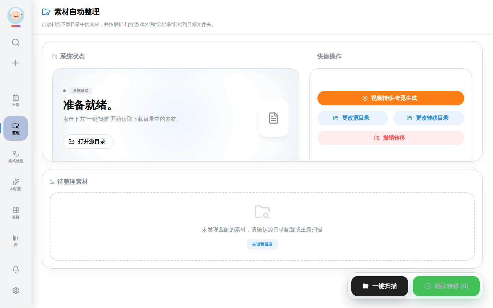
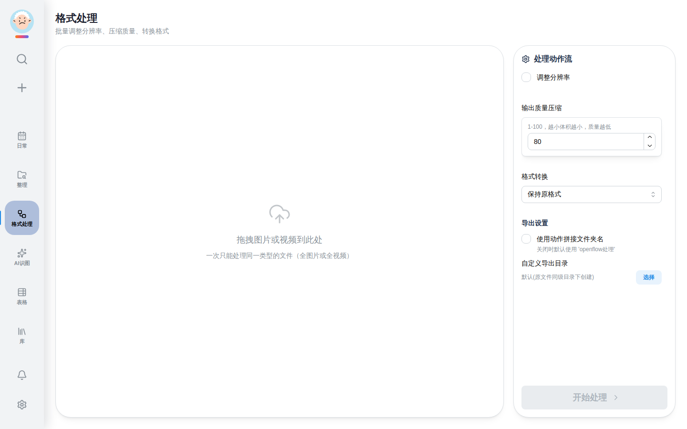
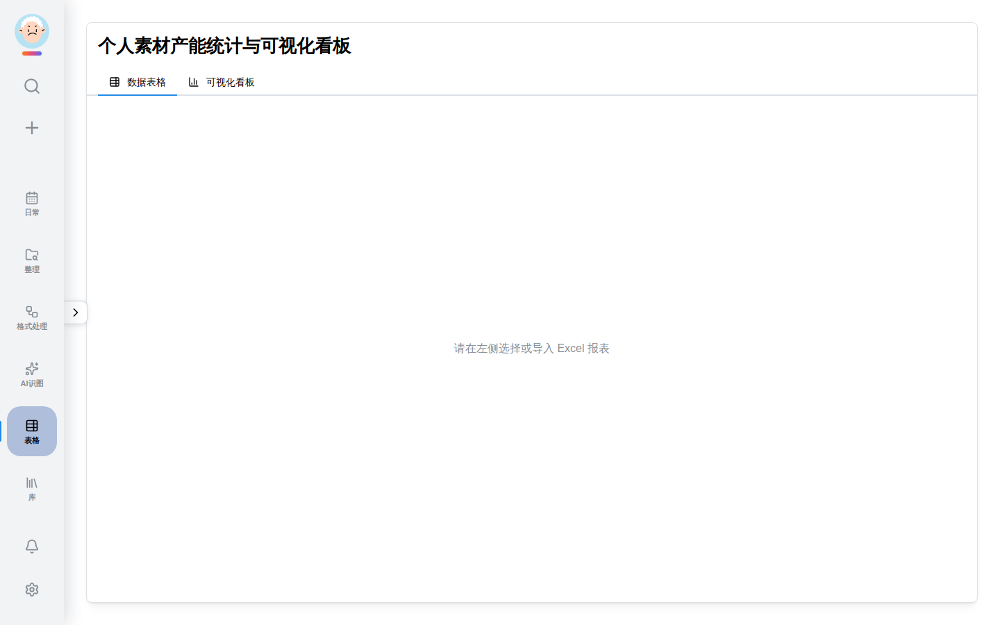
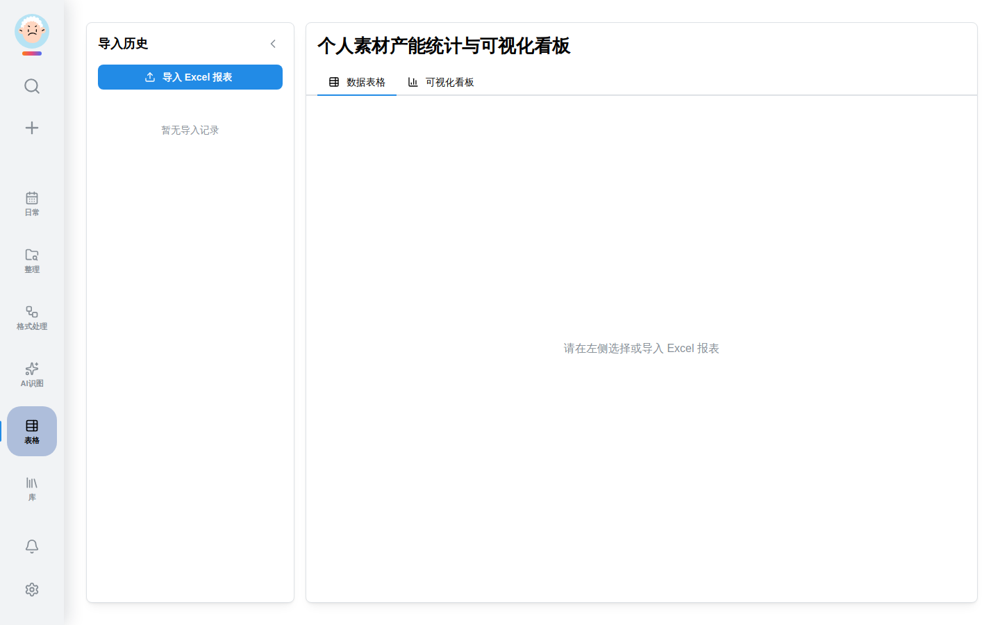

# OpenFlow使用指南

欢迎使用 OpenFlow Studio！这是一款专为数字内容创作者、游戏开发者和资产管理员打造的本地化全栈效率工具。OpenFlow 旨在帮助你更高效地管理工作流、自动整理素材文件、处理特殊格式并提升日常工作效率。

本指南将详细介绍 OpenFlow 各个核心模块的功能及操作步骤。

---

## 目录
1. [日常工作区](#日常工作区)
2. [整理工作区](#整理工作区)
3. [格式处理](#格式处理)
4. [多维表格](#多维表格)
5. [软件设置](#软件设置)
6. [正在优化中的功能](#正在优化中的功能)

---

## 日常工作区

日常工作区是主要的工作流处理中心，提供需求数据对接、尺寸校验与一键自动重命名等核心功能。

### 主要功能与操作步骤

1. **导入需求表数据**：
   - 准备好需求表 JSON 文件。
   - 点击界面上的**导入需求表**按钮。
   - 在弹窗中选择并读取 JSON 文件，此时会自动同步需求列表、素材尺寸等信息，同时左侧的“已选尺寸”会自动勾选。

2. **批量创建需求目录**：
   - 导入需求后，点击**创建目录**。
   - 在弹出的配置窗口中确认目标路径与目录列表，然后一键创建结构化文件夹。

3. **添加素材目录并校验**：
   - 使用左下角的 **添加目录** 或直接将文件夹拖拽至界面中心。
   - 在“已选尺寸”中勾选对应的尺寸参数。
   - 点击**执行校验**，软件会扫描已添加目录下的素材，对比你所选择的尺寸，并以列表形式展示校验结果（包括尺寸不符或缺少必要文件）。

4. **自动重命名与导出**：
   - 只有在全部校验通过后，重命名按钮才会被激活。
   - 点击**执行重命名**，软件将根据你在**软件设置**中配置的重命名模板，对合格素材自动完成重命名。
   - 处理完成后，文件状态会更新，且你可以在“操作历史”中查看变更日志。

---

## 整理工作区

整理工作区主要用于文件的批量归档、分类整理和自动化文件转移。它根据文件类型和自定义规则将零散文件归类到指定位置。

### 主要功能与操作步骤

1. **设置扫描与目标路径**：
   - 首先通过顶部的控制面板，设置**源文件夹**（即你想要整理的素材存放位置）和**目标文件夹**（整理后文件的存放位置）。
   - 你可以选择是否开启“整理后删除源文件”等高级选项。

2. **选择整理规则**：
   - 根据需求在界面中勾选文件格式大类（如：图片素材、模型文件、音频文件、文档等）。
   - 可启用“子文件夹结构保持”或“自动生成日期文件夹”来增强归档的结构性。

3. **执行整理**：
   - 配置完成后，点击右下角的**开始整理**。
   - 界面上方的日志区域会实时显示文件扫描及移动进度，处理完成后会弹出通知提醒。

---

## 格式处理

格式处理模块专为创意工作者设计，提供快速的图片格式转换（如 PSD/PNG 转 JPG）、视频/动图转换，以及 AI 模型所需特定格式的批处理功能。

### 主要功能与操作步骤

1. **选择处理任务类型**：
   - 在左侧菜单或下拉列表中选择要执行的任务（例如：图片转码、分辨率缩放、格式打包）。

2. **添加待处理文件**：
   - 支持多选文件或直接拖拽文件/文件夹进入“待处理区域”。
   - 列表将预览所选文件的基本信息（格式、大小等）。

3. **配置参数**：
   - 根据任务不同，可以调整相应的参数：
     - **图片转换**：设置目标格式（WebP, JPG, PNG）、压缩质量等。
     - **尺寸缩放**：按比例或输入固定宽高。

4. **开始处理**：
   - 点击**开始处理**按钮，文件会按批次进行转换，输出到在设置中配置好的默认输出目录（或原文件所在目录，按你的偏好决定）。

---

## 多维表格

多维表格是一个集成的轻量级表格数据管理模块，便于管理游戏词条、数据分析或简单的资产台账。

### 主要功能与操作步骤

> **注**：多维表格目前保留为全新界面占位区，我们正在进行功能细化，后续将提供完整的富文本、多视图（看板、网格）支持。

1. **浏览与编辑**：
   - 当前可用于查看基本的表单数据和需求记录。
   - 可以在日常版块中看到其底层数据流动的缩影。

---

## 软件设置

设置模块用于全局配置 OpenFlow 的各种参数、模板规则及快捷键绑定。

### 主要功能与操作步骤

1. **基本设置与用户信息**：
   - 设置你的**姓名（制作人）**、**部门**等信息，这些信息可以在后续重命名模板中作为占位符使用。

2. **工作流设置（模板与路径）**：
   - **默认输出目录**：所有处理和整理后文件的默认保存位置。
   - **重命名规则（模板）**：使用内置的标签拖拽组合你的命名规范。例如 `%date%_%project%_%size%` 等，可根据公司规范灵活拼装。

3. **系统设置与快捷键**：
   - **外观主题**：支持浅色和深色模式切换。
   - **消息通知**：配置通知弹窗的行为。
   - **快捷键**：配置常用功能的全局快捷键（如一键截图、一键呼出等）。

4. **应用与保存**：
   - 所有设置更改将即刻自动保存，部分设置需重新进入工作区才能生效。

---

## 正在优化中的功能

以下功能正在内部开发与优化中，敬请期待！

* **AI 识图 (AI Workspace)**：通过本地或云端大模型，全自动识别图片内容、风格，并实现自动批量重命名，极大地减少人工确认的繁琐工作。
* **库 (Library / Game Dictionary)**：用于统一管理游戏资产术语、标准词典和中英文对照规范库。
* **OpenFlow 截图工具 (Screenshot Tool)**：提供定制化的全屏/区域截图、标注、长截图与快捷键一键存档能力。

---

**感谢使用 OpenFlow Studio！如有问题，请随时参考系统内“消息中心”获取最新日志和提醒。**